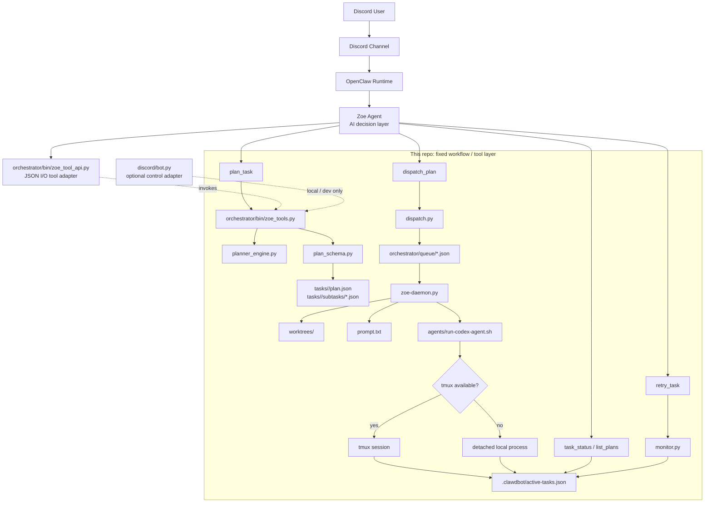

# AI DevOps

Zoe tool layer for planning, dispatching, and running coding agents against local Git worktrees.

## What This Repo Does

This repository contains the fixed workflow layer behind Zoe:

- Zoe, as an OpenClaw agent, can decide which local tool to call
- This repo provides deterministic tools for planning, validation, dispatch, execution, and monitoring
- A local `discord.py` bot still exists as an optional control adapter for development and fallback operations
- The dispatcher archives the plan and writes runnable subtasks into the local queue
- `zoe-daemon` consumes queue items, creates Git worktrees, writes prompts, and starts agents with `tmux` when available or a detached local process otherwise
- `monitor` watches active tasks, PR status, and CI, and can trigger retry loops when CI fails

The current implementation focuses on:

- structured task planning
- prompt compilation per subtask
- phased multi-subtask planning for implementation, validation, and docs work
- dependency-aware dispatch
- compatibility with the existing queue/daemon/monitor flow

## Architecture



Simplified execution path:

```text
Discord -> OpenClaw -> Zoe agent
  -> zoe_tools.py
  -> planner_engine.py / plan_schema.py / dispatch.py
  -> orchestrator/queue/*.json
  -> zoe-daemon.py
  -> run-codex-agent.sh
  -> active-tasks.json
  -> monitor.py
```

## Key Directories

- `discord/`: optional local control adapter and bot env file
- `orchestrator/bin/`: tool layer, schema validation, daemon, monitor, and dispatch logic
- `orchestrator/queue/`: pending execution tasks consumed by `zoe-daemon`
- `tasks/`: archived plans and subtask snapshots under `tasks/<planId>/`
- `worktrees/`: per-task or shared plan worktrees
- `repos/`: source repositories from which worktrees are created
- `agents/`: runner scripts for coding agents
- `.clawdbot/`: runtime registry for active tasks
- `docs/`: focused operational docs
- `tests/`: pytest coverage for plan schema and dispatch behavior

## Important Files

- `discord/bot.py`: optional local control adapter that calls the same tool layer used by Zoe
- `orchestrator/bin/zoe_tools.py`: unified Python tool layer for planning, dispatch, and status operations
- `orchestrator/bin/zoe_tool_contract.py`: machine-readable tool contracts for Zoe's agent-facing API
- `orchestrator/bin/zoe_tool_api.py`: JSON I/O adapter for agent tool calls
- `orchestrator/bin/zoe_planner.py`: compatibility CLI wrapper around `zoe_tools.py`
- `orchestrator/bin/planner_engine.py`: Zoe's internal planning engine
- `orchestrator/bin/plan_schema.py`: strict validation for plan JSON, subtask inheritance, DAG checks, and prompt limits
- `orchestrator/bin/dispatch.py`: queue payload generation and dependency-gated dispatch
- `orchestrator/bin/zoe-daemon.py`: queue consumer, worktree manager, prompt writer, and agent spawner
- `orchestrator/bin/monitor.py`: PR/CI watcher and Ralph Loop retry logic
- `orchestrator/bin/prompt_compiler.py`: legacy prompt fallback when a task has no precomputed prompt
- `docs/zoe_planner.md`: planner-specific usage and troubleshooting

## Planner Flow

When Zoe decides to plan work, the tool layer does this:

1. accepts a normalized planning request from Zoe or an optional local control adapter
2. builds a normalized planning request
3. lets Zoe plan the work inside the orchestrator
4. validates the returned plan before accepting it
5. writes:
   - `tasks/<planId>/plan.json`
   - `tasks/<planId>/subtasks/<subtaskId>.json`
6. dispatches the first runnable subtasks into `orchestrator/queue/`
7. returns structured data that Zoe can turn into a final reply or follow-up action

If planning fails through the optional local Discord adapter, that adapter falls back to a single queue task and marks it with `metadata.plannedBy = "fallback"`.

## Queue and Execution Model

Each dispatched queue item includes the legacy fields already expected by `zoe-daemon`:

- `id`
- `repo`
- `title`
- `description`
- `agent`
- `model`
- `effort`

Planner metadata is attached under `metadata`, including:

- `planId`
- `subtaskId`
- `dependsOn`
- `worktreeStrategy`
- `filesHint`
- `plannedBy`

`zoe-daemon.py` now prefers `task["prompt"]` when present. If a queue item does not carry a prompt, it falls back to the older template prompt compiler.

## Environment

Core environment variables:

- `DISCORD_TOKEN`
- `DISCORD_GUILD_ID`
- `DISCORD_CHANNEL`
- `DISCORD_ALLOWED_USERS`
- `DISCORD_ALLOWED_ROLE_IDS`
- `AI_DEVOPS_HOME`
- `CODEX_RUNNER_PATH`
- `CLAUDE_RUNNER_PATH`
- `CODEX_BIN`

## Local Usage

Agent-facing JSON schema:

```bash
./.venv/bin/python orchestrator/bin/zoe_tool_api.py schema --pretty
```

Agent-facing tool invocation:

```bash
printf '%s\n' '{"tool":"list_plans","args":{"limit":3}}' | \
  ./.venv/bin/python orchestrator/bin/zoe_tool_api.py invoke
```

Run the planner directly:

```bash
./.venv/bin/python orchestrator/bin/zoe_planner.py plan --task-file /tmp/task.json
./.venv/bin/python orchestrator/bin/zoe_planner.py dispatch --plan-file ~/ai-devops/tasks/<planId>/plan.json
./.venv/bin/python orchestrator/bin/zoe_planner.py plan-and-dispatch --task-file /tmp/task.json
```

Run tests:

```bash
./.venv/bin/python -m pytest -q
```

## Testing

Current test coverage includes:

- valid plan acceptance
- missing dependency rejection
- dependency cycle rejection
- prompt length guardrails
- queue file generation
- topological dispatch order

## Notes

- `monitor.py` is still responsible for CI-triggered retry handling
- Zoe is expected to act as the AI decision layer in OpenClaw; this repo is the deterministic tool layer Zoe calls
- `pydantic` is not currently used in this repo; validation is implemented in typed Python code in `plan_schema.py`
- `agents/run-codex-agent.sh` now provisions its own PTY via `script`, so Codex can run under `tmux` or without it

## Further Reading

- `docs/zoe_planner.md`
