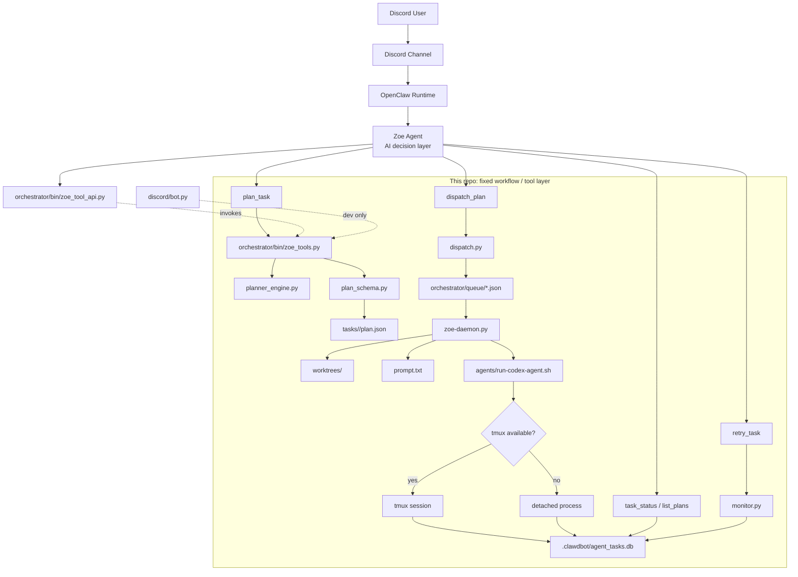

# AI DevOps

Zoe tool layer for planning, dispatching, and running coding agents against local Git worktrees.

[](https://github.com/gordon8018/ai-devops/actions/workflows/ci.yml)
[](docs/TEST_COVERAGE.md)

## What This Repo Does

This repository contains the fixed workflow layer behind Zoe:

- **Zoe** (OpenClaw agent) decides which local tool to call
- **This repo** provides deterministic tools for planning, validation, dispatch, execution, and monitoring
- **discord.py bot** (optional) local control adapter for development and fallback operations
- **Dispatcher** archives plans and writes runnable subtasks into the local queue
- **zoe-daemon** consumes queue items, creates Git worktrees, writes prompts, and starts agents
- **monitor** watches active tasks, PR status, and CI; triggers retry loops on failure

### Core Capabilities

- Structured task planning with validation
- Prompt compilation per subtask
- Phased multi-subtask planning (implementation → validation → docs)
- Dependency-aware dispatch
- SQLite-based task tracking
- GitHub webhook integration
- CI failure detection with automatic retry (Ralph Loop)

## Architecture


```mermaid
flowchart TD
    U[Discord User] --> DC[Discord Channel]
    DC --> OC[OpenClaw Runtime]
    OC --> Z[Zoe Agent<br/>AI decision layer]

    Z --> T1[plan_task]
    Z --> T2[dispatch_plan]
    Z --> T3[task_status / list_plans]
    Z --> T4[retry_task]

    subgraph ToolLayer["This repo: fixed workflow / tool layer"]
        T1 --> P[orchestrator/bin/zoe_tools.py]
        P --> E[planner_engine.py]
        P --> S[plan_schema.py]
        S --> T[tasks/<planId>/plan.json]

        T2 --> D[dispatch.py]
        D --> Q[orchestrator/queue/*.json]

        Q --> ZD[zoe-daemon.py]
        ZD --> W[worktrees/]
        ZD --> PR[prompt.txt]
        ZD --> A[agents/run-codex-agent.sh]

        A --> X{tmux available?}
        X -->|yes| TM[tmux session]
        X -->|no| BG[detached process]

        TM --> REG[.clawdbot/agent_tasks.db]
        BG --> REG

        T3 --> REG
        T4 --> M[monitor.py]
        M --> REG
    end

    Z --> API[orchestrator/bin/zoe_tool_api.py]
    API -. invokes .-> P
    B[discord/bot.py] -. dev only .-> P
```

**Simplified flow:**
```
Discord → OpenClaw → Zoe → zoe_tools.py → planner_engine.py
  → plan.json + subtasks/*.json → dispatch.py → queue/*.json
  → zoe-daemon.py → worktrees/ + prompt.txt → run-codex-agent.sh
  → agent_tasks.db → monitor.py
```

## Quick Start

### Prerequisites

- Python 3.12+
- Node.js (for OpenClaw)
- tmux (optional, for agent sessions)
- GitHub CLI (optional, for PR monitoring)

### Installation

```bash
# Clone and setup
git clone https://github.com/gordon8018/ai-devops.git
cd ai-devops
python3 -m venv .venv
source .venv/bin/activate
pip install -e .
pip install pytest pytest-cov python-dotenv
```

### Environment Setup

```bash
# Copy example env file
cp discord/.env.example discord/.env

# Edit with your credentials
# Required: DISCORD_TOKEN, DISCORD_GUILD_ID, DISCORD_CHANNEL
```

### Run Tests

```bash
# Quick test
./scripts/test.sh

# With coverage
./scripts/test.sh --coverage

# Run specific test
./scripts/test.sh --test tests/test_db.py::TestTaskCRUD
```

## Key Directories

| Directory | Purpose |
|-----------|---------|
| `discord/` | Optional local control adapter and bot env |
| `orchestrator/bin/` | Tool layer, schema, daemon, monitor, dispatch |
| `orchestrator/queue/` | Pending execution tasks |
| `tasks/` | Archived plans (`tasks/<planId>/plan.json`) |
| `worktrees/` | Per-task Git worktrees |
| `repos/` | Source repositories |
| `agents/` | Runner scripts for coding agents |
| `.clawdbot/` | SQLite database for task tracking |
| `docs/` | Operational documentation |
| `tests/` | Pytest test suite (104 tests) |

## Important Files

| File | Purpose |
|------|---------|
| `orchestrator/bin/zoe_tools.py` | Unified tool layer for planning/dispatch |
| `orchestrator/bin/zoe_tool_api.py` | JSON I/O adapter for agent tool calls |
| `orchestrator/bin/planner_engine.py` | Zoe's internal planning engine |
| `orchestrator/bin/plan_schema.py` | Plan validation (DAG checks, prompt limits) |
| `orchestrator/bin/dispatch.py` | Queue generation, dependency-gated dispatch |
| `orchestrator/bin/zoe-daemon.py` | Queue consumer, worktree manager, agent spawner |
| `orchestrator/bin/monitor.py` | PR/CI watcher, Ralph Loop retry logic |
| `orchestrator/bin/db.py` | SQLite task tracker |
| `orchestrator/bin/webhook_server.py` | GitHub webhook receiver |
| `orchestrator/bin/agent.py` | Agent CLI (spawn/list/status/kill) |

## Tool Contracts

Zoe exposes these tools via `zoe_tool_api.py`:

| Tool | Description |
|------|-------------|
| `plan_task` | Create a plan without dispatching |
| `plan_and_dispatch_task` | Create plan and dispatch immediately |
| `dispatch_plan` | Dispatch an existing plan |
| `task_status` | Get status of a specific task |
| `list_plans` | List recent plans |

### Query Tool Schema

```bash
./.venv/bin/python orchestrator/bin/zoe_tool_api.py schema --pretty
```

### Invoke Tool

```bash
printf '%s\n' '{"tool":"list_plans","args":{"limit":3}}' | \
  ./.venv/bin/python orchestrator/bin/zoe_tool_api.py invoke
```

## Planner Flow

1. **Accept** normalized planning request from Zoe or local adapter
2. **Build** planning request with repo, title, objective, constraints
3. **Plan** using `planner_engine.py` (generates subtasks with dependencies)
4. **Validate** plan (DAG checks, prompt limits, schema validation)
5. **Write** `tasks/<planId>/plan.json` + `subtasks/*.json`
6. **Dispatch** runnable subtasks to `orchestrator/queue/`
7. **Return** structured data for Zoe's response

## Queue and Execution Model

### Queue Item Structure

```json
{
  "id": "1773448846631-test-repo-fix-auth-S1",
  "repo": "test/repo",
  "title": "Land the primary implementation",
  "description": "Fix auth flow",
  "agent": "codex",
  "model": "gpt-5.3-codex",
  "effort": "high",
  "prompt": "DoD: fix auth.\nBoundary: stay scoped.",
  "metadata": {
    "planId": "1773448846631-test-repo-fix-auth",
    "subtaskId": "S1",
    "dependsOn": [],
    "worktreeStrategy": "isolated",
    "filesHint": ["src/auth/session.ts"],
    "plannedBy": "zoe"
  }
}
```

### Execution Lifecycle

```
queued → running → pr_created → ready → merged
                          ↓
                    needs_rebase / blocked / timeout
```

## Environment Variables

| Variable | Description |
|----------|-------------|
| `DISCORD_TOKEN` | Discord bot token |
| `DISCORD_GUILD_ID` | Discord server ID |
| `DISCORD_CHANNEL` | Default channel ID |
| `DISCORD_ALLOWED_USERS` | Comma-separated user IDs |
| `AI_DEVOPS_HOME` | AI DevOps home directory (default: `~/ai-devops`) |
| `CODEX_RUNNER_PATH` | Path to Codex runner script |
| `GITHUB_WEBHOOK_SECRET` | Webhook signature secret |

## Testing

### Test Suite

- **104 test cases** across 10 test files
- **54% overall coverage**
- Runs on every push/PR via GitHub Actions

### Coverage by Module

| Module | Coverage |
|--------|----------|
| `errors.py` | 100% |
| `planner_engine.py` | 93% |
| `plan_schema.py` | 89% |
| `dispatch.py` | 85% |
| `db.py` | 75% |
| `zoe_tools.py` | 75% |
| `prompt_compiler.py` | 71% |
| `webhook_server.py` | 49% |
| `monitor.py` | 45% |
| `agent.py` | 33% |

See [docs/TEST_COVERAGE.md](docs/TEST_COVERAGE.md) for details.

### Run Tests

```bash
# All tests
./scripts/test.sh

# With coverage report
./scripts/test.sh --coverage

# Specific test file
python -m pytest tests/test_monitor.py -v

# Specific test
python -m pytest tests/test_db.py::TestTaskCRUD::test_insert_task -v
```

## CI/CD

Automated on GitHub Actions:

- **Test**: Python 3.12, pytest with coverage
- **Lint**: flake8, black, isort
- **Coverage**: Uploads to Codecov

Triggered on:
- Push to `main`/`master`
- Pull requests to `main`/`master`

See `.github/workflows/ci.yml` for configuration.

## Notes

- **monitor.py** handles CI-triggered retry (Ralph Loop)
- **Zoe** is the AI decision layer; this repo is the deterministic tool layer
- **No pydantic** - validation uses typed Python in `plan_schema.py`
- **run-codex-agent.sh** provisions PTY via `script` for tmux compatibility

## Troubleshooting

### Common Issues

| Issue | Solution |
|-------|----------|
| Queue files not consumed | Check `zoe-daemon.py` is running |
| Task stuck in `running` | Check `monitor.py` logs, verify tmux session |
| CI retry not triggering | Verify `DISCORD_WEBHOOK_URL` in env |
| Plan validation fails | Check `docs/zoe_planner.md` for schema |

### Logs

```bash
# Daemon logs
tail -f logs/zoe-daemon.log

# Monitor logs
tail -f logs/monitor.log

# Webhook logs
tail -f logs/webhook.log
```

## Further Reading

- [docs/zoe_planner.md](docs/zoe_planner.md) - Planner usage and troubleshooting
- [docs/TEST_COVERAGE.md](docs/TEST_COVERAGE.md) - Detailed test coverage report
- [docs/agent-cli.md](docs/agent-cli.md) - Agent CLI reference
- [docs/sqlite-migration-summary.md](docs/sqlite-migration-summary.md) - Database migration notes
- [docs/webhook-setup.md](docs/webhook-setup.md) - GitHub webhook configuration

---

**License:** MIT | **Maintainer:** Gordon Yang
