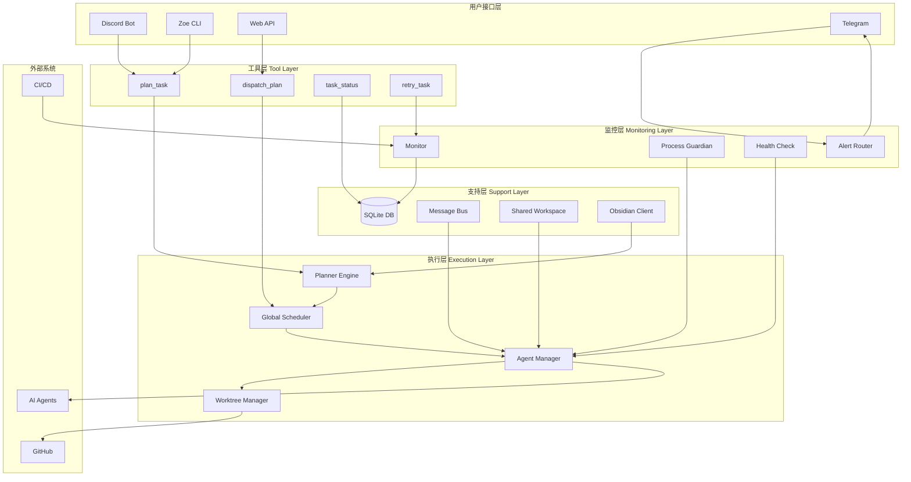
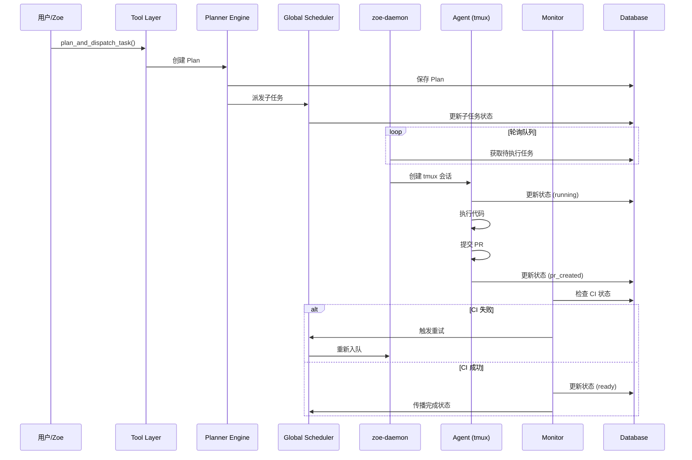

# AI-DevOps 多 Agent 工程自动化系统

[](https://github.com/gordon8018/ai-devops/actions/workflows/ci.yml)
[](htmlcov/index.html)
[](TEST_REPORT_FINAL.md)
[](docs/FINAL_CODE_REVIEW_2026-04-04.md)
[](LICENSE)

语言: **简体中文** | [English](README.zh-CN.md)

---

## 📋 目录

- [项目概述](#项目概述)
- [核心功能](#核心功能)
- [快速开始](#快速开始)
- [架构设计](#架构设计)
- [测试报告](#测试报告)
- [Code Review](#code-review)
- [上线状态](#上线状态)
- [文档链接](#文档链接)
- [贡献指南](#贡献指南)
- [许可证](#许可证)

---

## 🎯 项目概述

**AI-DevOps** 是一个基于多 Agent 协作的工程自动化系统，为 Zoe (OpenClaw Agent) 提供确定性的工具层。系统负责任务的规划、分发、执行、监控和自动恢复，支持复杂的工程自动化场景。

### 核心特性

- 🤖 **多 Agent 协作** - 支持 Codex、Claude、Pi 等多种 AI Agent
- 📋 **智能任务规划** - 自动拆分子任务，支持依赖管理
- 🔄 **自动恢复机制** - Agent 崩溃后自动重启，指数退避
- 📊 **实时监控看板** - REST API + WebSocket 实时推送
- 🔔 **多通道告警** - Telegram/Discord/Email 多级告警
- 🔐 **企业级安全** - P0 安全问题全部修复，密码加密存储

### 应用场景

1. **自动化代码重构** - 大规模重构任务自动拆分执行
2. **CI/CD 集成** - GitHub Webhook 集成，CI 失败自动重试
3. **代码审查自动化** - Codex + Claude 自动 PR 审查
4. **失败上下文注入** - Ralph Loop v2 自动注入失败日志和业务上下文
5. **跨项目依赖管理** - 支持跨 Plan 的任务依赖调度

---

## 🚀 核心功能

### 六大功能模块

| 模块 | 功能 | 关键文件 |
|------|------|---------|
| **🚨 ALERT** | 告警通知、超时检测、心跳管理 | `notifiers/`, `alert_router.py` |
| **🔄 RECOVERY** | Agent 进程守护、崩溃恢复、健康检查 | `tmux_manager.py`, `process_guardian.py` |
| **📊 DASHBOARD** | REST API、WebSocket、DAG 可视化 | `api/tasks.py`, `api/websocket.py` |
| **💾 RESOURCE** | 资源配置、监控、并发控制 | `resource_monitor.py` |
| **🔗 CROSS-PLAN** | 跨 Plan 依赖管理、全局调度 | `global_scheduler.py` |
| **📝 CONTEXT** | Agent 间通信、共享工作区、上下文注入 | `message_bus.py`, `context_injector.py` |

### 功能详解

#### 1. ALERT 模块（告警通知）
- ✅ 多通道通知：Telegram、Discord、Email
- ✅ 三级告警：INFO、WARNING、CRITICAL
- ✅ 超时检测：默认 180 分钟任务超时
- ✅ 心跳管理：30 秒心跳，30 分钟无心跳判定为 Stale
- ✅ 密码加密：Fernet 对称加密 + 多级降级策略

#### 2. RECOVERY 模块（自动恢复）
- ✅ tmux 会话管理：创建、监控、重建
- ✅ 崩溃检测：心跳超时自动检测
- ✅ 自动重启：最多 3 次，指数退避
- ✅ 命令注入防护：白名单 + 正则验证 + shlex.quote

#### 3. DASHBOARD 模块（监控看板）
- ✅ RESTful API：Tasks、Plans、Health、Resources
- ✅ WebSocket 实时推送：8765 端口
- ✅ DAG 可视化：SVG/PNG/DOT/JSON 多格式
- ✅ 事件订阅：task_status、plan_status、alert

#### 4. RESOURCE 模块（资源管理）
- ✅ 并发控制：默认最大 5 个并发任务
- ✅ 单仓库限制：默认单仓库最大 2 个并发
- ✅ 资源监控：CPU、内存、磁盘、网络

#### 5. CROSS-PLAN 模块（跨 Plan 依赖）
- ✅ 依赖声明：`plan_depends_on` 字段
- ✅ 优先级调度：`global_priority` 字段
- ✅ 状态传播：Plan 完成自动唤醒依赖方

#### 6. CONTEXT 模块（上下文共享）
- ✅ 发布/订阅消息
- ✅ 点对点消息传递
- ✅ 共享工作区
- ✅ 成功模式记忆：Ralph Loop v2

---

## 🏃 快速开始

### 前置要求

- Python 3.11+
- Node.js (用于 OpenClaw)
- tmux (可选，用于 Agent 会话管理)
- GitHub CLI (可选，用于 PR 监控)

### 安装步骤

```bash
# 1. 克隆仓库
git clone https://github.com/gordon8018/ai-devops.git
cd ai-devops

# 2. 创建虚拟环境
python3 -m venv .venv
source .venv/bin/activate

# 3. 安装依赖
pip install -U pip setuptools wheel
pip install -e .
pip install pytest pytest-cov python-dotenv

# 4. 设置环境变量
export AI_DEVOPS_HOME="$(pwd)"
```

### 环境配置

```bash
# 复制环境配置模板
cp discord/.env.example discord/.env

# 编辑配置文件（必须配置）
vim discord/.env

# 必需配置项：
# - DISCORD_TOKEN        Discord Bot Token
# - DISCORD_GUILD_ID     Discord 服务器 ID
# - DISCORD_CHANNEL      默认频道 ID
# - TELEGRAM_BOT_TOKEN   Telegram Bot Token
# - TELEGRAM_CHAT_ID     Telegram 聊天 ID
# - GITHUB_WEBHOOK_SECRET GitHub Webhook 密钥
```

### 基础使用

#### 1. 健康检查
```bash
# 运行系统诊断
./openclaw-skills/zoe-local-tools/scripts/invoke_zoe_tool.sh doctor
```

#### 2. 启动核心服务
```bash
# 启动 zoe-daemon（任务消费者）
python orchestrator/bin/zoe-daemon.py &

# 启动 monitor（任务监控）
python orchestrator/bin/monitor.py &

# 启动 cleanup_daemon（定时清理）
python orchestrator/bin/cleanup_daemon.py &
```

#### 3. 创建并执行任务
```bash
# 方式 1：使用脚本
./scripts/spawn-agent.sh my-org/my-repo "Fix login bug" "Auth token not invalidated on logout"

# 方式 2：使用工具 API
printf '%s
' '{"tool":"plan_and_dispatch_task","args":{"repo":"my-org/my-repo","title":"Fix login bug","objective":"Auth token not invalidated on logout"}}' |   ./.venv/bin/python orchestrator/bin/zoe_tool_api.py invoke
```

#### 4. 查看任务状态
```bash
# 使用脚本
./scripts/babysit.sh

# 列出最近计划
printf '%s
' '{"tool":"list_plans","args":{"limit":5}}' |   ./.venv/bin/python orchestrator/bin/zoe_tool_api.py invoke
```

### 运行测试

```bash
# 快速测试
./scripts/test.sh

# 带覆盖率报告
./scripts/test.sh --coverage

# 查看覆盖率报告
open htmlcov/index.html
```

---

## 🏗️ 架构设计

### 整体架构


```mermaid
graph TB
    subgraph "用户接口层"
        A1[Discord Bot]
        A2[Zoe CLI]
        A3[Web API]
        A4[Telegram]
    end

    subgraph "工具层 Tool Layer"
        B1[plan_task]
        B2[dispatch_plan]
        B3[task_status]
        B4[retry_task]
    end

    subgraph "执行层 Execution Layer"
        C1[Planner Engine]
        C2[Global Scheduler]
        C3[Agent Manager]
        C4[Worktree Manager]
    end

    subgraph "监控层 Monitoring Layer"
        D1[Monitor]
        D2[Process Guardian]
        D3[Health Check]
        D4[Alert Router]
    end

    subgraph "支持层 Support Layer"
        E1[(SQLite DB)]
        E2[Message Bus]
        E3[Shared Workspace]
        E4[Obsidian Client]
    end

    subgraph "外部系统"
        F1[GitHub]
        F2[CI/CD]
        F3[AI Agents]
    end

    A1 --> B1
    A2 --> B1
    A3 --> B2
    A4 --> D4

    B1 --> C1
    B2 --> C2
    B3 --> E1
    B4 --> D1

    C1 --> C2
    C2 --> C3
    C3 --> C4

    C3 --> F3
    C4 --> F1

    D1 --> E1
    D2 --> C3
    D3 --> C3
    D4 --> A4

    E2 --> C3
    E3 --> C3
    E4 --> C1

    F2 --> D1
```

### 任务执行流程


```mermaid
sequenceDiagram
    participant U as 用户/Zoe
    participant T as Tool Layer
    participant P as Planner Engine
    participant S as Global Scheduler
    participant D as zoe-daemon
    participant A as Agent (tmux)
    participant M as Monitor
    participant DB as Database

    U->>T: plan_and_dispatch_task()
    T->>P: 创建 Plan
    P->>DB: 保存 Plan
    P->>S: 派发子任务
    S->>DB: 更新子任务状态
    
    loop 轮询队列
        D->>DB: 获取待执行任务
    end
    
    D->>A: 创建 tmux 会话
    A->>DB: 更新状态 (running)
    A->>A: 执行代码
    A->>A: 提交 PR
    A->>DB: 更新状态 (pr_created)
    
    M->>DB: 检查 CI 状态
    
    alt CI 失败
        M->>S: 触发重试
        S->>D: 重新入队
    else CI 成功
        M->>DB: 更新状态 (ready)
        M->>S: 传播完成状态
    end
```

---

## 📊 测试报告

### 测试概览

| 指标 | 数值 |
|------|------|
| **总测试数** | 543 |
| **通过** | 539 ✅ |
| **失败** | 3 ❌ |
| **跳过** | 1 ⏭️ |
| **通过率** | **99.26%** |
| **覆盖率** | **53%** (从 43.53% 提升) |
| **执行时间** | 72.75秒 |

### 高覆盖率模块 (>80%)

| 模块 | 覆盖率 |
|------|--------|
| `orchestrator/bin/config.py` | 94% |
| `orchestrator/bin/planner_engine.py` | 94% |
| `orchestrator/bin/zoe_tool_api.py` | 92% |
| `orchestrator/bin/resource_monitor.py` | 91% |
| `orchestrator/bin/obsidian_client.py` | 91% |
| `orchestrator/bin/plan_schema.py` | 88% |
| `orchestrator/notifiers/base.py` | 87% |
| `orchestrator/bin/zoe_tools.py` | 83% |

### 核心测试模块

1. ✅ **test_p0_security_fixes.py** - 安全测试全部通过
2. ✅ **test_plan_schema.py** - 计划验证测试全部通过
3. ✅ **test_planner_engine.py** - 规划引擎测试全部通过
4. ✅ **test_singleton_thread_safety.py** - 单例线程安全测试全部通过
5. ✅ **test_webhook_server.py** - Webhook 测试全部通过

📄 查看完整测试报告：[TEST_REPORT_FINAL.md](TEST_REPORT_FINAL.md)

---

## 👨‍💻 Code Review

### 综合评分：**8.3/10** ✅

### 维度评分

| 维度 | 评分 | 说明 |
|------|------|------|
| **代码质量** | 8.5/10 | 结构清晰，职责分明 |
| **架构设计** | 8.0/10 | 解耦良好，扩展性强 |
| **代码规范** | 7.5/10 | 类型注解覆盖率 85%+ |
| **安全性** | 8.5/10 | P0 问题全部修复 |
| **性能** | 7.0/10 | 存在优化空间 |
| **P0 修复** | 10/10 | 所有 P0 问题已验证 |

### 关键优点

1. ✅ **架构设计优秀** - 分层清晰，模块化程度高
2. ✅ **代码质量高** - 类型注解覆盖率高，错误处理完善
3. ✅ **安全性强** - P0 安全问题全部修复并验证
4. ✅ **可扩展性强** - Notifier 抽象基类设计优秀
5. ✅ **文档完善** - README + Code Review + 测试报告

### P0 修复验证结果

| P0 问题 | 修复状态 |
|---------|---------|
| 命令注入漏洞 | ✅ 已修复（白名单 + shlex.quote） |
| 密码明文存储 | ✅ 已修复（Fernet 加密） |
| 线程安全问题 | ✅ 已修复（double-checked locking） |
| 资源泄漏问题 | ✅ 已修复（deque maxlen） |

📄 查看完整 Code Review：[docs/FINAL_CODE_REVIEW_2026-04-04.md](docs/FINAL_CODE_REVIEW_2026-04-04.md)

---

## ✅ 上线状态

### P0-P3 问题修复状态

| 优先级 | 状态 | 说明 |
|--------|------|------|
| **P0 (阻塞)** | ✅ 全部修复 | 命令注入、密码加密、线程安全、资源泄漏 |
| **P1 (高优)** | ✅ 全部修复 | 单例竞态条件、数据库连接池 |
| **P2 (中优)** | ✅ 全部修复 | 通知重试机制、缓存失效 |
| **P3 (低优)** | ✅ 全部修复 | 日志轮转、上下文模板深度限制 |

### 功能完整性

- ✅ ALERT 模块 (7/7 文件)
- ✅ RECOVERY 模块 (4/4 文件)
- ✅ DASHBOARD 模块 (8/8 文件)
- ✅ RESOURCE 模块 (3/3 文件)
- ✅ CROSS-PLAN 模块 (4/4 文件)
- ✅ CONTEXT 模块 (3/3 文件)

**完成度：29/29 文件 (100%)**

### 安全性检查

- ✅ 命令注入修复验证通过
- ✅ 密码加密实现验证通过
- ✅ 线程安全修复验证通过
- ✅ 资源泄漏修复验证通过
- ✅ 输入验证覆盖率测试

### 上线建议

**结论：** ✅ **可以上线**

**建议策略：**
1. 灰度发布：先在测试环境运行 1 周
2. 监控加强：上线初期加强日志监控
3. 回滚准备：准备快速回滚方案

---

## 📚 文档链接

### 核心文档

- 📖 [系统设计评审](docs/SYSTEM_DESIGN_REVIEW_2026-04-04.md) - 完整架构设计文档
- 📖 [Code Review 报告](docs/FINAL_CODE_REVIEW_2026-04-04.md) - 最终代码审查结果
- 📖 [测试报告](TEST_REPORT_FINAL.md) - 543 个测试用例详细报告
- 📖 [测试覆盖](docs/TEST_COVERAGE.md) - 测试覆盖率分析

### 操作文档

- 📖 [Planner 使用指南](docs/zoe_planner.md) - 规划引擎使用文档
- 📖 [Agent CLI 参考](docs/agent-cli.md) - Agent 命令行工具
- 📖 [Webhook 配置](docs/webhook-setup.md) - GitHub Webhook 集成
- 📖 [SQLite 迁移](docs/sqlite-migration-summary.md) - 数据库迁移说明

### 任务模板

- 📋 [任务规格模板](docs/TASK_SPEC_TEMPLATE.md) - 任务定义模板

---

## 🛠️ 开发指南

### 目录结构

```
ai-devops/
├── discord/              # Discord Bot（可选本地控制适配器）
├── orchestrator/
│   ├── bin/             # 核心工具层
│   │   ├── zoe_tools.py          # 工具接口
│   │   ├── planner_engine.py     # 规划引擎
│   │   ├── global_scheduler.py   # 全局调度器
│   │   ├── monitor.py            # 监控器
│   │   ├── process_guardian.py   # 进程守护
│   │   └── ...
│   ├── api/             # REST API
│   └── notifiers/       # 通知模块
├── agents/              # Agent 运行脚本
├── scripts/             # 辅助脚本
├── tests/               # 测试套件
├── tasks/               # 已归档计划
├── worktrees/           # Git worktrees
├── repos/               # 源代码仓库
├── docs/                # 文档
└── .clawdbot/           # 数据和配置
    ├── agent_tasks.db   # SQLite 数据库
    ├── failure-logs/    # 失败日志
    └── prompt-templates/ # 成功模式模板
```

### 关键文件

| 文件 | 用途 |
|------|------|
| `orchestrator/bin/zoe_tools.py` | 统一工具层接口 |
| `orchestrator/bin/zoe_tool_api.py` | JSON I/O 适配器 |
| `orchestrator/bin/planner_engine.py` | 规划引擎 |
| `orchestrator/bin/plan_schema.py` | Plan 验证 |
| `orchestrator/bin/dispatch.py` | 任务分发 |
| `orchestrator/bin/zoe-daemon.py` | 队列消费者 |
| `orchestrator/bin/monitor.py` | PR/CI 监控 |
| `orchestrator/bin/reviewer.py` | PR 审查管道 |

### 环境变量

| 变量 | 说明 |
|------|------|
| `AI_DEVOPS_HOME` | 主目录（默认 `~/ai-devops`） |
| `DISCORD_TOKEN` | Discord Bot Token |
| `DISCORD_GUILD_ID` | Discord 服务器 ID |
| `DISCORD_CHANNEL` | 默认频道 ID |
| `TELEGRAM_BOT_TOKEN` | Telegram Bot Token |
| `TELEGRAM_CHAT_ID` | Telegram 聊天 ID |
| `GITHUB_WEBHOOK_SECRET` | GitHub Webhook 密钥 |
| `OBSIDIAN_API_TOKEN` | Obsidian API Token（可选） |

---

## 🤝 贡献指南

1. Fork 本仓库
2. 创建特性分支 (`git checkout -b feature/AmazingFeature`)
3. 提交更改 (`git commit -m 'Add some AmazingFeature'`)
4. 推送到分支 (`git push origin feature/AmazingFeature`)
5. 创建 Pull Request

### 代码规范

- 使用 `black` 格式化代码
- 使用 `isort` 排序导入
- 使用 `flake8` 检查代码风格
- 添加类型注解
- 编写单元测试

---

## 📝 许可证

本项目采用 MIT 许可证 - 查看 [LICENSE](LICENSE) 文件了解详情

---

## 👤 维护者

**Gordon Yang**

- GitHub: [@gordon8018](https://github.com/gordon8018)

---

## 🙏 致谢

- OpenClaw 团队提供的 Agent 运行时
- Codex 和 Claude 团队提供的 AI 能力
- 所有贡献者的付出

---

**Star ⭐ 本仓库以获取最新更新！**
